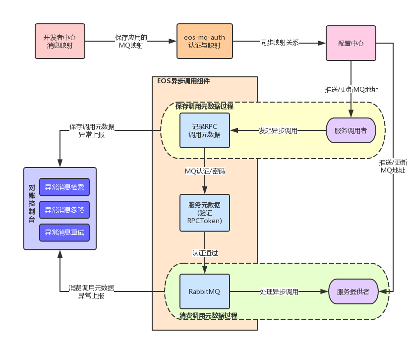
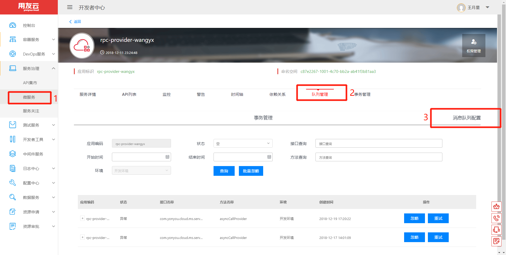
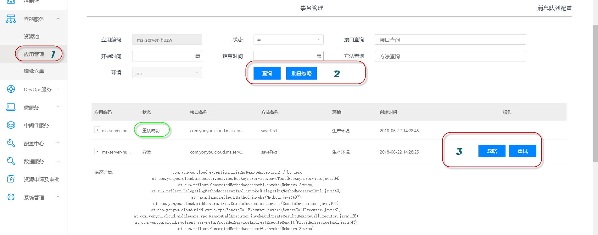

# 异步调用EOS

## 产品介绍

企业级分布式异步调用数据一致性组件（名称 EOS）, 为企业提供高可用和分布式的异步数据一致性解决方案。

EOS 充分利用快速的异步消息和本地事务，并在此基础上提供了一系列强大的功能，包括事务内的消息发送和接收处理、人工对账控制台、重试/忽略异常消息、链路追踪等。这些功能经过严苛的压力测试和稳定性测试, 保证EOS的高性能和稳定性。

通过 EOS，您可以轻松构建异步调用服务，为您的服务建设大规模异步快速调用，保证数据的最终一致性，以满足不断增长的业务需求。


## 功能介绍

* 提供接口的异步调用和处理能力.
* 保证接口调用和接收处理的数据一致性, 并保证整个调用过程的最终数据一致性.
* 提供人工对账界面, 对于超出重试次数的业务调用进行人工干预处理.
* 提供公共消息中间件, 也可自建由用友云提供消息中间件的连接认证.


## EOS架构图


*  项目中引入eos框架，应用启动后悔自动创建以下几个数据库表：<br/>
   tm_locks<br/>
   tm_mqerror<br/>
   tm_mqrecv_error<br/>
   tm_mqrecv_success<br/>
   tm_mqsend_error<br/>
   tm_mqsend_success_20181216<br/>
   .....<br/>
   其中tm_mqsend_success_*用了分表策略，由eos框架自动提前创建，默认提前创建十天的表<br/>


## EOS使用示例
* 第一步：开发公共接口,maven工程

     ```
               <parent>
		    <groupId>com.yonyou.cloud</groupId>
		    <artifactId>rpceos-demosi</artifactId>
		    <version>5.1.1-SNAPSHOT</version>
	       </parent>
	       <artifactId>rpcprovider-pubapi</artifactId>
	       <packaging>jar</packaging>
                <!--引入eos-->
		<dependency>
			<groupId>com.yonyou.cloud.middleware</groupId>
			<artifactId>eos-spring-support</artifactId>
			<version>${eos-spring-support.version}</version>
		</dependency>
		 <!--引入sdk-->
		<dependency>
			<groupId>com.yonyou.cloud.middleware</groupId>
			<artifactId>mwclient</artifactId>
			<version>${mw.version}</version>
			<type>pom</type>
		</dependency>

     /**
       * rpcprovider 接口
       * @author Administrator
       *
       */
     @RemoteCall("rpcprovider@c87e2267-1001-4c70-bb2a-ab41f3b81aa3")
     public interface IService {

	  @ApiOperation(value="echo服务", response=String.class)
	  @Async
	  public abstract String cancelOrder(String echo);
     }
   
   ```


* 第二步：开发服务端项目,maven工程

       ```
                <parent>
		    <groupId>com.yonyou.cloud</groupId>
		    <artifactId>rpceos-demos</artifactId>
		    <version>5.1.1-SNAPSHOT</version>
	       </parent>
	       <artifactId>rpcprovider-pubapi</artifactId>
	       <packaging>jar</packaging>
                <!--引入eos-->
		<dependency>
			<groupId>com.yonyou.cloud.middleware</groupId>
			<artifactId>eos-spring-support</artifactId>
			<version>${eos-spring-support.version}</version>
		</dependency>

		<!--引入sdk-->
		<dependency>
			<groupId>com.yonyou.cloud.middleware</groupId>
			<artifactId>mwclient</artifactId>
			<version>${mw.version}</version>
			<type>pom</type>
		</dependency>

                <!--引入公共接口-->
		<dependency>
			<groupId>com.yonyou.cloud</groupId>
			<artifactId>rpcprovider-pubapi</artifactId>
			<version>5.1.1-SNAPSHOT</version>
		</dependency>

       /**
       * rpcprovider 接口实现
       * @author Administrator
       *
       */
     @RemoteCall("rpcprovider@c87e2267-1001-4c70-bb2a-ab41f3b81aa3")
     public class ServiceImpl implements IService {

	  @ApiOperation(value="echo服务", response=String.class)
	  @Async
	  public  String cancelOrder(String echo) {
	      return "hello" + echo;
	  }
     }

   ```

* 第三步：开发客户端项目,maven工程

   ```
         <parent>
		    <groupId>com.yonyou.cloud</groupId>
		    <artifactId>rpceos-demos</artifactId>
		    <version>5.1.1-SNAPSHOT</version>
	 </parent>
	  <artifactId>rpcprovider-pubapi</artifactId>
	  <packaging>jar</packaging>
          <!--引入eos-->
	 <dependency>
			<groupId>com.yonyou.cloud.middleware</groupId>
			<artifactId>eos-spring-support</artifactId>
			<version>${eos-spring-support.version}</version>
	</dependency>

	<!--引入sdk-->
	<dependency>
			<groupId>com.yonyou.cloud.middleware</groupId>
			<artifactId>mwclient</artifactId>
			<version>${mw.version}</version>
			<type>pom</type>
	</dependency>

         <!--引入公共接口-->
	<dependency>
			<groupId>com.yonyou.cloud</groupId>
			<artifactId>rpcprovider-pubapi</artifactId>
			<version>5.1.1-SNAPSHOT</version>
        </dependency>
   ```

   在controller中调用IService接口,如下<br/>
   
   ```
   @RestController
   @RequestMapping({ "/rpc/" })
    public class OrderController {
	@Autowired
	private IService service;

	@RequestMapping({ "service" })
	@ResponseBody
	public String service(String echo) {
		try {
		     String res = this.service.service(echo);
		     return res;
		} catch (Exception e) {
			return "error :" + e.getMessage();
		}
	}
    }
   ```
* 第四步：build客户端和服务端项目，生成war包，copy到tomcat或者在开发者中心持续构建或流水线构建。在开发者中心将会有这两个

* 第五步：配置eos消息队列
* EOS控制台为EOS处理异常消息的事务管理界面, 为用户提供了业务无法通过重试成功的消息的查询及重试/忽略操作界面.

* 在使用EOS框架前, 需要配置应用的RabbitMQ地址:
	* 页面导航: 开发者中心左边菜单 &gt;&gt; 微服务 &gt;&gt; 服务管理 &gt;&gt; 找到对应的应用 &gt;&gt; 点进对应的环境 &gt;&gt;可靠消息 &gt;&gt; 消息队列配置 &gt;&gt; 在输入框中填写RabbitMQ地址, 如: IP1:Port1,IP2:Port2; 参见下图:

* 消息地址配置输入框:


* 配置完消息地址后, 按照异步框架的开发指南进行工程配置, 若有异常会上报到EOS控制台; 按照以下步骤查询异常消息: <p>开发者中心左边菜单 &gt;&gt; 服务治理 &gt;&gt; 微服务 &gt;&gt; 找到对应的应用 &gt;&gt; 点进对应的环境 &gt;&gt; 微服务 &gt;&gt; **事务管理** &gt;&gt;</p>
* 点击重试后会下发命令到客户端进行重试, 客户端重试完成后会上报重试结果, 重试成功后会在状态列中显示"重试成功", 否则显示"重试失败".
* 点击忽略后会下发命令到客户端进行忽略, 被忽略的消息应交由人工处理, 进行数据的校对和检查.



