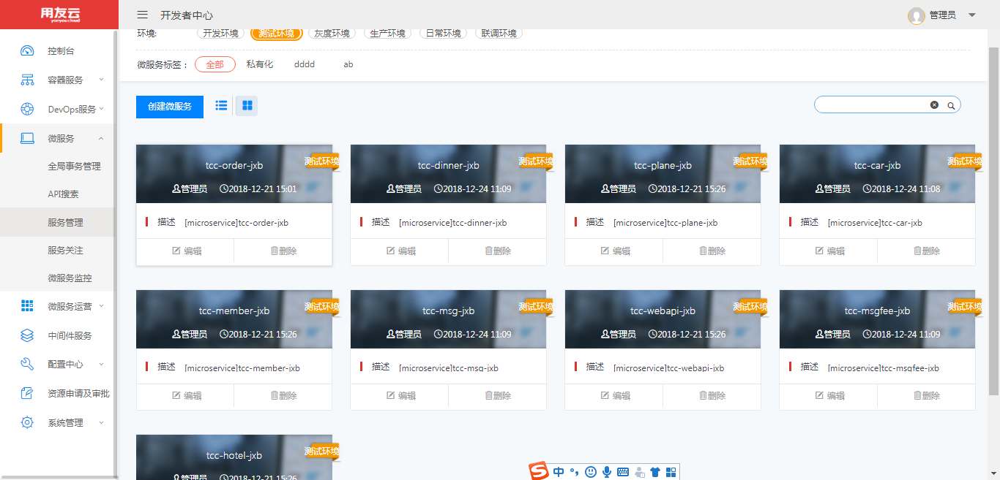
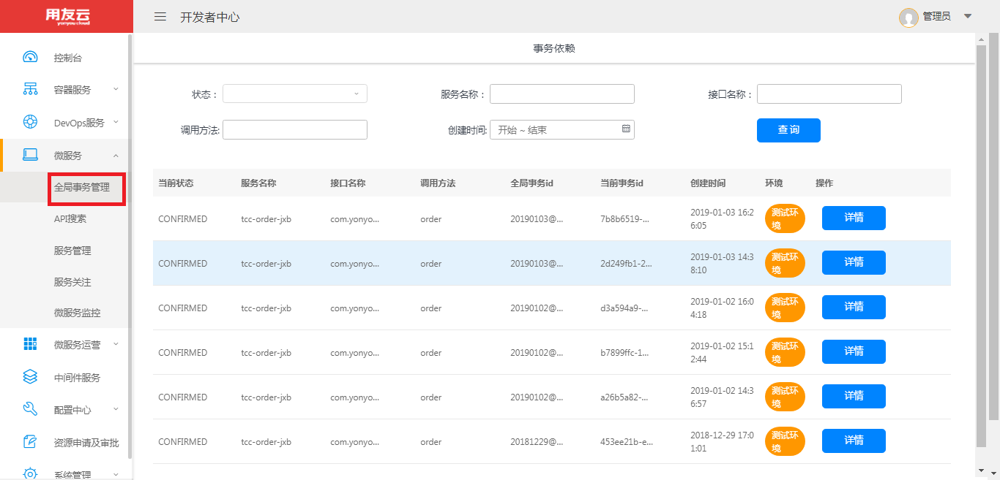
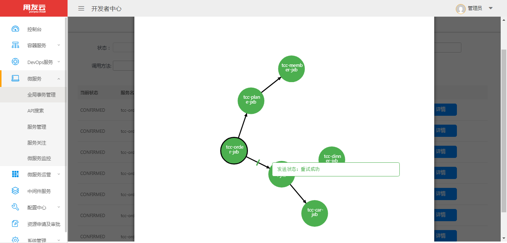

## TccTransaction分布式事务框架·用户指南

## 产品介绍

TccTransaction分布式事务框架是解决微服务开发环境中，事务一致性问题而提出的一种解决方案，与传统TCC分布式事务一致性方案不同，
TccTransaction是一个没有事务协调器、没有事务中心概念，事务由各个参与者共同完成整个事务的管理，是用友微服务治理平台提供的
一个核心功能组件。
## 与传统tcc的优缺点
* 优点
	1. 使用简单，业务只需要使用注解，并提供共confirm及cancel方法即可
	2. 没有事务协调器，各节点平等参与事务，各节点记录自己的事务信息，避免了中心服务器的瓶颈
	3. 由业务节点自行confirm或cancel
	4. 非常适合微服务调用链事务一致性

* 缺点
	1. 由于没有事务协调器，事务信息分散在各业务节点，不利于全局事务监控
	2. 需要各业务节点向全局事务控制平台上报各自异常的事务信息，有可能出现在控制台看不到完整的事务参与者信息


## 功能介绍

* 解决分布式事务一致性问题，业务使用分布式事务一致性功能只需两个注解，  @TccTransactional(confirm="confirmOrder", cancel="cancelOrder")标识业务方法需要使用分布式事务
  confirm属性指定了业务事务提交方法，cancel属性指定了业务异常时的取消方法，与业务方法在同一个接口中实现，提交或取消方法上加入  @Async注解
* 基于可靠消息的异步调用框架（EOS）的最终一致性
* 支持链式rpc调用中各个业务节点的事务一致性
* 基于用友微服务治理平台rpc框架Iris
* 事务信息数据与业务库一起，保证业务与消息发送一致性，分布式事务数据记录由框架自行操作，用户无需关心
* Tcc框架支持软隔离机制，可通过两种方式来实现隔离：1）将try阶段执行资源预留，confirm阶段执行提交，预留后的资源其它系统无法获取，如预扣，账户合法性检查，
  真正数据库操作在confirm阶段执行insert或update操作，2）在try阶段执行预插入及更新操作，并由业务对数据有效性状态进行标记，由confirm或cancel修改数据状态，confirm后的数据可用
* 支持事务上下文，在try阶段可将用户数据存储到当前事务上下文中，然后在confirm或cancel方法内可以根据获取try阶段设置的事务上下文信息
* confirm、cancel方法第一个参数为TccTransactionContext context，代表当前事务上下文信息
* 事务边界：
	1. 第一个rpc 服务endpoint，事务开始于服务端，服务端同步调用其它服务时处于同一个全局事务 
	2. 异步调用，异步调用是事务起点
	3. sagas与tcc事务混用时，两个服务之间调用如果调用端和服务端用了不一样的事务框架，则，被调用端开启新事务
*  confirm及cancel方法必须确保幂等性操作
*  rpc重试机制，如果出现超时及网络问题，导致业务重试，每次重试都会向后继续调用，后续调用可能成功或失败，每次调用后都会根据当前全局事务状态来确定重试返回时是提交还是取消事务状态

## 数据库模型:
Tcc事务框架要求每个事务节点各自记录事务信息，通过以下两个表记录事务及事务调用关系
<br>**1.tcctransation表：记录当前业务参与的事务上下文及状态信息**
<table border="1px" align="left" bordercolor="black" width="80%"">
<tr align="left"><td>字段名字</td><td>字段类型</td><td>备注</td></tr>
<tr align="left"><td>gt_id</td> <td>varchar</td> <td>全局事务id，参与事务的各节点通过gt_id来标识一次全局事务</td> </tr>
<tr align="left"><td>tx_id</td> <td>varchar</td> <td>当前节点事务id</td> </tr>
<tr align="left"><td>ptx_id</td> <td>varchar</td> <td>上级事务id</td> </tr>
<tr align="left"><td>status</td> <td>varchar</td> <td>事务状态，记录当前节点在全局事务中所处的状态，取值为以下四种
CONFIRMING（进入事务方法时的状态）
FAILED（业务方法异常时的状态）
CANCEL(成功cancel后的状态)
CONFIRMED(成功确认后的状态)
</td> </tr>
<tr align="left"><td>type</td> <td>varchar</td> <td>事务类型：ROOT，起点， BRANCH参与节点</td> </tr>
<tr align="left"><td>context</td> <td>varchar</td> <td>存储事务开始时用户存储当前事务的信息，在confirm或cancel方法中可以取出来</td> </tr>
<tr align="left"><td>invocation</td> <td>blob</td> <td>业务方法的Rpc调用上下文信息</td> </tr>  
 
<tr align="left"><td>service_name</td> <td>varchar</td> <td>发起调用的服务名</td> </tr>  
<tr align="left"><td>interface_name</td> <td>varchar</td> <td>发起调用的接口名</td> </tr>  
<tr align="left"><td>method_name</td> <td>varchar</td> <td>发起调用的方法</td> </tr>  
<tr align="left"><td>pk</td> <td>bigint</td> <td>自增主键</td> </tr>  
</table>

<br>**2.tcctransation_rel表：记录当前事务中调用的下级事务关系上下文及状态**
<table border="1px" align="left" bordercolor="black" width="80%">
<tr align="left"><td>字段名字</td><td>字段类型</td><td>备注</td></tr>
<tr align="left"><td>gt_id</td> <td>varchar</td> <td>全局事务id，参与事务的各节点通过gt_id来标识一次全局事务</td> </tr>
<tr align="left"><td>tx_id</td> <td>varchar</td> <td>当前节点事务id</td> </tr>
<tr align="left"><td>ptx_id</td> <td>varchar</td> <td>上级事务id</td> </tr>
<tr align="left"><td>call_service_name</td> <td>varchar</td> <td>调用方服务名</td> </tr>
<tr align="left"><td>call_interface_name</td> <td>varchar</td> <td>调用方接口名</td> </tr>
<tr align="left"><td>call_method_name</td> <td>varchar</td> <td>调用方服务名</td> </tr>
<tr align="left"><td>service_name</td> <td>varchar</td> <td>被调用方服务名</td> </tr>
<tr align="left"><td>interface_name</td> <td>varchar</td> <td>被调用接口</td> </tr>  
<tr align="left"><td>method_name</td> <td>varchar</td> <td>被调用方法名</td> </tr>  
<tr align="left"><td>cancel</td> <td>int</td> <td>值为1时，已经发起cancel，避免重复调用</td> </tr>  
<tr align="left"><td>confirm</td> <td>int</td> <td>值为1时，已经发起confirm，避免重复调用</td> </tr>  
<tr align="left"><td>confirm_invocation</td> <td>varchar</td> <td>Confirm的rpc上下文</td> </tr>  
<tr align="left"><td>confirm_method</td> <td>varchar</td> <td>Confirm方法</td> </tr>  
<tr align="left"><td>cancel_invocation</td> <td>varchar</td> <td>Cancel的rpc上下文</td> </tr>  
<tr align="left"><td>cancel_method</td> <td>varchar</td> <td>Cancel方法</td> </tr> 
<tr align="left"><td>pk</td> <td>bigint</td> <td>自增主键</td> </tr> 
<tr align="left"><td>parent_pk</td> <td>bigint</td> <td>上级事务pk</td> </tr> 
<tr align="left"><td>invocation</td> <td>blob</td> <td>rpc上下文</td> </tr> 
</table>
<br><br><br><br><br><br><br><br><br><br><br><br><br><br><br><br><br><br><br><br><br><br><br><br><br><br><br><br><br><br><br><br><br><br><br><br><br><br><br><br><br><br><br>


## TccTransaction事务场景
* TccTransaction分布式事务框架解决rpc链式同步调用事务一致性
  

## TccTransaction事务使用案例  
* 业务场景，见图，实箭头表示同步调用，虚箭头为异步调用  
  


*  要使用tcc事务，需要引入sdk、eos及tcc框架，且需要在业务数据库中创建eos和tcc相关的数据库表
   引入eos框架后，应用启动后悔自动创建以下几个数据库表：<br/>
   tm_locks<br/>
   tm_mqerror<br/>
   tm_mqrecv_error<br/>
   tm_mqrecv_success<br/>
   tm_mqsend_error<br/>
   tm_mqsend_success_20181216<br/>
   .....<br/>
   其中tm_mqsend_success_*用了分表策略，由eos框架自动提前创建，默认提前创建十天的表<br/>

   tcc框架会自动在业务数据库中创建数据库表<br/>
   tcc_transaction_20181216<br/>
   .........<br/>
   tcc_transaction_20181226<br/>
   .........<br/>
   其中tcc_transaction_*与tcc_transaction_rel*用了分表策略，由tcc框架自动提前创建，默认提前创建十天的表<br/>


tcc事务框架使用最佳实践，本实例以旅游订单为例，共涉及九个微服务实例，调用关系如图，其中webapi是服务网关，提供访问微服务的入口，可通过http://host:port/tcc-webapi/tcc/order/?name=***&dest=**发起访问服务
## 第一步：开发服务接口项目，服务接口在服务端和调用端都需要使用，所以将接口单独作为一个maven工程,引入依赖
          <parent>
		    <groupId>com.yonyou.cloud</groupId>
		    <artifactId>tcc-demos</artifactId>
		    <version>5.1.1-SNAPSHOT</version>
	     </parent>
	     <artifactId>tcc-pubapi</artifactId>
	     <packaging>jar</packaging>

                <!--引入tcc-->
		<dependency>
			<groupId>com.yonyou.cloud.middleware</groupId>
			<artifactId>tcc</artifactId>
			<version>${tcc.version}</version>
		</dependency>
		
                <!--引入eos-->
		<dependency>
			<groupId>com.yonyou.cloud.middleware</groupId>
			<artifactId>eos-spring-support</artifactId>
			<version>${eos-spring-support.version}</version>
		</dependency>
		
		      <!--引入sdk-->
		<dependency>
			<groupId>com.yonyou.cloud.middleware</groupId>
			<artifactId>mwclient</artifactId>
			<version>${mw.version}</version>
			<type>pom</type>
		</dependency>

 **各接口定义如下：**

    /**
     * 订单服务
     * @author Administrator
     *
     */
     @RemoteCall("tcc-order-gh@c87e2267-1001-4c70-bb2a-ab41f3b81aa3")
     public interface IOrderService {

	  @ApiOperation(value="下旅游订单", response=TourOrder.class)
	  @TccTransactional(confirm="confirmOrder", cancel="cancelOrder")
	  public abstract TourOrder order(TourOrder paramTourOrder);

	  @ApiOperation(value="确定旅游订单", response=TourOrder.class)
	  @Async
	  public abstract TourOrder confirmOrder(TccTransactionContext context, TourOrder paramTourOrder);
	  
	  @ApiOperation(value="取消旅游订单", response=TourOrder.class)
	  @Async
	  public abstract TourOrder cancelOrder(TccTransactionContext context, TourOrder paramTourOrder);
     }


    /**
     * 机票预订服务
     * @author Administrator
     *
     */
     //应用名@租户id
     @RemoteCall("tcc-plane-gh@c87e2267-1001-4c70-bb2a-ab41f3b81aa3")
     public interface IMsPlaneService {
	  @ApiOperation(value="预订机票", response=Void.class)
	  // 业务方法，由sdk同步调用
	  @TccTransactional(confirm="confirmPlane", cancel="cancelPlane")
	  public abstract void orderPlane(PlaneOrder paramPlaneOrder);

	  
	  // 注意 Async注解为 com.yonyou.cloud.middleware.rpc.Async，此方法由框架自动调用，异步执行，用于确认业务修改
	  @ApiOperation(value="确定机票预定", response=Void.class)
	  @Async
	  public abstract void confirmPlane(TccTransactionContext context, PlaneOrder paramPlaneOrder);
	  

	   // 注意 Async注解为 com.yonyou.cloud.middleware.rpc.Async，此方法由框架自动调用，异步执行，用于取消业务修改
	  @ApiOperation(value="取消机票预定", response=Void.class)
	  @Async
	  public abstract void cancelPlane(TccTransactionContext context, PlaneOrder paramPlaneOrder);
	  
	  
     }

    /**
     * 积分服务
     * @author Administrator
     *
     */
     @RemoteCall("tcc-member-gh@c87e2267-1001-4c70-bb2a-ab41f3b81aa3")
     public interface IMsMemberService {
	  @ApiOperation(value="会员积分", response=Void.class)
	  @TccTransactional(confirm="confirmPoints", cancel="cancelPoints")
	  public abstract void addPoints(String paramString1, String paramString2, Double paramDouble);
	 
	 
	  @ApiOperation(value="确认会员积分", response=Void.class)
	  @Async
	  public abstract void confirmPoints(TccTransactionContext context, String paramString1, String paramString2, Double paramDouble);
	  
	  @ApiOperation(value="取消会员积分", response=Void.class)
	  @Async
	  public abstract void cancelPoints(TccTransactionContext context, String paramString1, String paramString2, Double paramDouble);
     }

    /**
     * 酒店预订服务
     * @author Administrator
     *
     */

     @RemoteCall("tcc-hotel-gh@c87e2267-1001-4c70-bb2a-ab41f3b81aa3")
     public interface IMsHotelService {
	  @ApiOperation(value="预订酒店", response=Void.class)
	  @TccTransactional(confirm="confirmHotel", cancel="cancelHotel")
	  public abstract void orderHotel(HotelOrder paramHotelOrder);

	  @ApiOperation(value="确认酒店预订", response=Void.class)
	  @Async
	  public abstract void confirmHotel(TccTransactionContext context, HotelOrder paramHotelOrder);
	  
	  @ApiOperation(value="取消酒店预订", response=Void.class)
	  @Async
	  public abstract void cancelHotel(TccTransactionContext context, HotelOrder paramHotelOrder);
     }


    /**
     * 车辆预订服务
     * @author Administrator
     *
     */
    @RemoteCall("tcc-car-gh@c87e2267-1001-4c70-bb2a-ab41f3b81aa3")
    public interface IMsCarService {
	  @ApiOperation(value="车辆预订", response=Void.class)
	  @TccTransactional(confirm="confirmCar", cancel="cancelCar")
	  public abstract void orderCar(CarOrder paramCarOrder);
	
	  @ApiOperation(value="确认车辆预订", response=Void.class)
	  @Async
	  public abstract void confirmCar(TccTransactionContext context, CarOrder paramCarOrder);
	  
	  
	  @ApiOperation(value="取消车辆预订", response=Void.class)
	  @Async
	  public abstract void cancelCar(TccTransactionContext context, CarOrder paramCarOrder);
	  
     }

    /**
     * 餐饮预订服务
     * @author Administrator
     *
     */
     @RemoteCall("tcc-dinner-gh@c87e2267-1001-4c70-bb2a-ab41f3b81aa3")
     public interface IMsDinnerService {
	
	  @ApiOperation(value="餐饮预定", response=Void.class)
	  @TccTransactional(confirm="confirmDinner", cancel="cancelDinner")
	  public abstract void orderDinner(DinnerOrder paramDinnerOrder);
	
	  
	  @ApiOperation(value="确认餐饮预定", response=Void.class)
	  @Async
	  public abstract void confirmDinner(TccTransactionContext context, DinnerOrder paramDinnerOrder);
	  
	  @ApiOperation(value="取消餐饮预定", response=Void.class)
	  @Async
	  public abstract void cancelDinner(TccTransactionContext context, DinnerOrder paramDinnerOrder);
     }

    /**
     * 异步服务，测试事务边界
     * @author Administrator
     *
     */
     @RemoteCall("tcc-msg-gh@c87e2267-1001-4c70-bb2a-ab41f3b81aa3")
     public interface IMsMsgService {
	  @ApiOperation(value="短信服务", response=Void.class)
	  @TccTransactional(confirm="confirmMsg", cancel="cancelMsg")
	  @Async
	  public abstract void sendMsg(String phone, String msg, String bizId);

	  @ApiOperation(value="确认短信服务", response=Void.class)
	  @Async
	  public abstract void confirmMsg(TccTransactionContext context, String phone, String msg, String bizId);
	 
	  @ApiOperation(value="取消短信服务", response=Void.class)
	  @Async
	  public abstract void cancelMsg(TccTransactionContext context, String phone, String msg, String bizId);
     }

    /**
     * 异步服务
     * @author Administrator
     *
     */
    @RemoteCall("tcc-msgfee-gh@c87e2267-1001-4c70-bb2a-ab41f3b81aa3")
    public interface IMsMsgFeeService {
	  @ApiOperation(value="短信计费服务", response=Void.class)
	  @TccTransactional(confirm="confirmMsgFee", cancel="cancelMsgFee")
	  public abstract void MsgFee(String bizId, Double fee);

	  @ApiOperation(value="确认短信计费服务", response=Void.class)
	  @Async
	  public abstract void confirmMsgFee(TccTransactionContext context, String bizId, Double fee);
	 
	  @ApiOperation(value="取消短信计费服务", response=Void.class)
	  @Async
	  public abstract void cancelMsgFee(TccTransactionContext context, String bizId, Double fee);
    }


## 第二步：开发服务，导入接口项目依赖，实现各个接口，在服务内实现服务之间的调用关系及confirm & cancel
新建maven项目，导入接口项目依赖及eos、sdk等其他依赖包，pom.xml如下

          <!--eos框架-->
		<dependency>
			<groupId>com.yonyou.cloud.middleware</groupId>
			<artifactId>eos-spring-support</artifactId>
			<!--需要引入eos-spring-support 5.1.0以后的包-->
			<version>${mw.version}</version>
		</dependency>

		<!--tcc事务框架包-->
		<dependency>
			<groupId>com.yonyou.cloud.middleware</groupId>
			<artifactId>Tcc</artifactId>
			<version>${Tcc.version}</version>
		</dependency>
		<!--引入middleware sdk-->
		<dependency>
			<groupId>com.yonyou.cloud.middleware</groupId>
			<artifactId>mwclient</artifactId>
			<version>${mw.version}</version>
			<type>pom</type>
		</dependency>

**在 springContext.xml配置文件中配置数据源、事务管理器、eos及tcc相关的bean定义**

*  在项目配置文件中加入相关bean定义
tcc和eos框架本身需要对数据库进行读写，内部使用了jdbctemplate进行数据库操作，业务尽量也使用jdbctemplate来进行数据库操作，事务及数据源都交由spring容器管理。
如果业务需要用其它orm框架，如hibernate、mybatis或者jpa，需要确保jdbctemplate和业务orm框架兼容使用同一数据源及事务管理器，确保业务和eos、tcc框架能在一个事务中。
jpa：业务使用jpa操作数据库时，EOSConfig配置的jdbctemplate要所配置DataSource要与jpa事务管理器使用同一个DataSource，TransactionManager应使用JpaTransactionManager
hibernate：业务使用hibernate操作数据库时使用 HibernateTransactionManager事务管理器
mybatis：业务使用mybatis操作数据库时使用DataSourceTransactionManager事务管理器
jdbctemplate：业务使用jdbctemplate操作数据库时使用DataSourceTransactionManager事务管理器

```
     <bean id="eosConfig" class="com.yonyou.cloud.config.eos.EOSConfig">
    		<property name="jdbcTemplate" ref="jdbcTemplate"/>
    		<property name="transactionManager" ref="transactionManager"/>
    		<property name="authSDKClient" ref="authSDKClient"/>
    		<property name="fullScanIntevalSend" value="0"/>
    		<property name="fullScanIntevalActionLog" value="0"/>
 	     <!--eos控制台地址，默认为registry地址+/eos-console/-->      	 
 	     <property name="eosCenterUrl" value="${eos.cloud.url:http://localhost/eos-console/}"/>
     </bean>
    
     <bean id="tccMonitorConfig" class="com.yonyou.cloud.config.TccMonitorConfig">
         <!--tcc事务控制台地址--，默认为registry地址+/eos-console/> 
 	  <property name="tccMonitorUrl" value="${tcc.cloud.url:https://developer-test.yonyoucloud.com/eos-console/}"/> 
     </bean>
     
     <!--jdbctemplate，配置数据库操作的jdbctemplate-->
     <bean id="jdbcTemplate" class="org.springframework.jdbc.core.JdbcTemplate">
        <property name="dataSource" ref="dataSource"></property>
     </bean>

     <!-- 启用spring事务管理器 -->
    <tx:annotation-driven transaction-manager="transactionManager" proxy-target-class="true"/>

     <!-- 事务配置 -->
    <bean id="transactionManager" class="org.springframework.jdbc.datasource.DataSourceTransactionManager">
        <property name="dataSource" ref="dataSource"/>
    </bean>
 
     <!-- 数据源配置, 使用Tomcat JDBC连接池    -->
    <bean id="dataSource" class="org.apache.tomcat.jdbc.pool.DataSource" destroy-method="close" lazy-init="false">
        <property name="driverClassName" value="${jdbc.driver}"/>
        <property name="url" value="${jdbc.url}"/>
        <property name="username" value="${jdbc.username}"/>
        <property name="password" value="${jdbc.password}"/>

        <property name="defaultAutoCommit" value="false"/>
        <property name="maxActive" value="${jdbc.pool.maxActive}"/>
        <property name="maxIdle" value="${jdbc.pool.maxIdle}"/>
        <property name="minIdle" value="${jdbc.pool.minIdle}"/>
        <property name="maxWait" value="${jdbc.pool.maxWait}"/>
        <property name="minEvictableIdleTimeMillis" value="${jdbc.pool.minEvictableIdleTimeMillis}"/>
        <property name="removeAbandoned" value="${jdbc.pool.removeAbandoned}"/>
        <property name="removeAbandonedTimeout" value="${jdbc.pool.removeAbandonedTimeout}"/>
        <property name="testWhileIdle" value="true"/> 
        <property name="validationQuery" value="select 1"/> 
    </bean>  

    <!--数据库连接池信息，tcc创建内部数据源使用，保持跟业务数据源配置信息一致  -->
    <bean id="specialJdbcTemplateConfig" class="com.yonyou.cloud.config.SpecialJdbcTemplateConfig">
        <property name="driverClassName" value="${jdbc.driver}"/>
        <property name="url" value="${jdbc.url}"/>
        <property name="username" value="${jdbc.username}"/>
        <property name="password" value="${jdbc.password}"/>
        <property name="defaultAutoCommit" value="true"/>
        <property name="maxActive" value="${jdbc.pool.maxActive}"/>
        <property name="maxIdle" value="${jdbc.pool.maxIdle}"/>
        <property name="minIdle" value="${jdbc.pool.minIdle}"/>
        <property name="maxWait" value="${jdbc.pool.maxWait}"/>
        <property name="minEvictableIdleTimeMillis" value="${jdbc.pool.minEvictableIdleTimeMillis}"/>
        <property name="removeAbandoned" value="${jdbc.pool.removeAbandoned}"/>
        <property name="removeAbandonedTimeout" value="${jdbc.pool.removeAbandonedTimeout}"/>
    </bean> 
    
    <!-- 使用annotation 自动注册bean, 并保证@Required、@Autowired的属性被注入 -->
    <context:component-scan base-package="com.yonyou.cloud">
	    <context:exclude-filter type="annotation" expression="org.springframework.stereotype.Controller"/>
	    <context:exclude-filter type="annotation" expression="org.springframework.web.bind.annotation.ControllerAdvice"/>
    </context:component-scan>
```

* 服务提供方实现业务接口

```
       /**
        * 订单服务
        * @author Administrator
        *
        */
      @Service("orderService")
      public  class OrderService implements IOrderService {
	  private static final Logger logger = LoggerFactory
			.getLogger(OrderService.class);
	  @Autowired
	  private JdbcTemplate jdbcTemplate;
	
	  @Autowired
	  private IMsHotelService msHotelService;
	
	  @Autowired
	  private IMsPlaneService msPlaneService;

	  public static final ObjectMapper OBJECT_MAPPER = new ObjectMapper();
	
	  @Transactional
	  public TourOrder order(TourOrder dto) {
		dto.setStatus(AppConstant.CONFIRMING);
		//执行当前服务的业务数据
		this.jdbcTemplate
				.update("insert into biz_tourorder (orderName,userId,userName,dest,status,tourOrderId) values (?,?,?,?,?,?)",
						new Object[] { dto.getOrderName(), dto.getUserId(),
								dto.getUserName(), dto.getDest(),
								dto.getStatus(), dto.getTourOrderId() });
		PlaneOrder planeOrder = new PlaneOrder();
		planeOrder.setAirport("首都国际机场");
		planeOrder.setArrive("上海虹桥机场");
		planeOrder.setPlaneNo("CCAC5982");
		planeOrder.setPlaneOrderId(UUID.randomUUID().toString());
		planeOrder.setPrice(Double.valueOf(2903.0D));
		planeOrder.setStart(new DateTime().toString());
		planeOrder.setUserId(dto.getUserId());
		planeOrder.setStatus(AppConstant.CONFIRMING);
		try {
		// 将当前业务数据保存到当前事务上下文中，便于在confirm或cancel时能够获取到该业务数据做提交或回退操作
			System.out.println(OBJECT_MAPPER.writeValueAsString(dto));
			TccTransactionUtils.setContext(OBJECT_MAPPER.writeValueAsString(dto));
		} catch (Throwable e) {
			e.printStackTrace();
			throw new RuntimeException("参数序列化异常");
		}
		// 发起对plane服务的调用，形成过一个同步调用链
	        this.msPlaneService.orderPlane(planeOrder);
		HotelOrder hotelOrder = new HotelOrder();
		hotelOrder.setStart(new DateTime().toString());
		hotelOrder.setEnd(new DateTime().toString());
		hotelOrder.setHotelName("锦江之星宾馆");
		hotelOrder.setHotelOrderId(UUID.randomUUID().toString());
		hotelOrder.setRoomNo("401");
		hotelOrder.setStatus(AppConstant.CONFIRMING);
		hotelOrder.setUserId(dto.getUserId());
		hotelOrder.setUserName(dto.getUserName());

		// 发起对hotel服务的调用，形成过一个同步调用链
		this.msHotelService.orderHotel(hotelOrder);
		return dto;
	  }

          // 整个调用链成功时，框架自动异步地执行该方法，确认业务的操作
	  @Transactional
	  public TourOrder confirmOrder(TccTransactionContext context,TourOrder dto) {
	        //获取当前事务上下文数据
		String restore = TccTransactionUtils.getContext(context);
		logger.info("===========================" + restore);
		this.jdbcTemplate.update(
				"update biz_tourorder set status=?  where tourOrderId=?",
				new Object[] { AppConstant.CONFIRMED, dto.getTourOrderId() });
		return dto;
	  }
	// 整个调用链有失败时，框架自动异步地执行该方法，取消业务的操作
	  @Transactional
	  public TourOrder cancelOrder(TccTransactionContext context,TourOrder dto) {
	        //获取当前事务上下文数据
		String restore = TccTransactionUtils.getContext(context);
		logger.info("===========================" + restore);
		this.jdbcTemplate.update(
				"update biz_tourorder set status=?  where tourOrderId=?",
				new Object[] { AppConstant.DELETED, dto.getTourOrderId() });
		return dto;
	  }
      }


       /**
        * 机票预订服务
        * @author Administrator
        *
        */
      @Service("msPlaneService")
      public class MsPlaneService implements IMsPlaneService {
	  private static final Logger logger = LoggerFactory
	 		.getLogger(MsPlaneService.class);
	
	  @Autowired
	  private JdbcTemplate jdbcTemplate;
	  @Autowired
	  IMsMemberService msMemberService;
	  public static final ObjectMapper OBJECT_MAPPER = new ObjectMapper();
	
	  @Transactional
	  public void orderPlane(PlaneOrder dto) {
			this.jdbcTemplate
					.update("insert into biz_planeorder(start,arrive,airport,price,userId,planeNo,planeOrderId,status) values (?,?,?,?,?,?,?,?)",
							new Object[] { dto

							.getStart(), dto.getArrive(), dto.getAirport(),
									dto.getPrice(), dto.getUserId(),
									dto.getPlaneNo(), dto.getPlaneOrderId(),
									dto.getStatus() });
	
		Double points = Double.valueOf(0.1D);
		String bizId = UUID.randomUUID().toString();
		try {
			TccTransactionUtils.setContext(OBJECT_MAPPER.writeValueAsString(dto));
		} catch (JsonProcessingException e) {
			// TODO Auto-generated catch block
			e.printStackTrace();
		}
		this.msMemberService.addPoints(dto.getUserId(), bizId, points);
	  }

	
	  @Transactional
	  public void confirmPlane(TccTransactionContext context, PlaneOrder dto) {
		String restore = TccTransactionUtils.getContext(context);
		logger.info("===========================" + restore);
		this.jdbcTemplate.update(
				"update biz_planeorder set status=? where planeOrderId=?",
				new Object[] { AppConstant.CONFIRMED, dto.getPlaneOrderId() });
	  }
	
	  @Transactional
	  public void cancelPlane(TccTransactionContext context, PlaneOrder dto) {
		String restore = TccTransactionUtils.getContext(context);
		logger.info("===========================" + restore);
		this.jdbcTemplate.update(
				"update biz_planeorder set status=? where planeOrderId=?",
				new Object[] { AppConstant.DELETED, dto.getPlaneOrderId() });
	  }
	
	  @Override
	  public String testAsync(String hello) {
		// TODO Auto-generated method stub
		return "hello world";
	  }
	
     }


       /**
        * 积分服务
        * @author Administrator
        *
        */

     @Service("msMemberService")
     public class MsMemberService implements IMsMemberService {
	  private static final Logger logger = LoggerFactory
			.getLogger(MsMemberService.class);
	  @Autowired
	  private JdbcTemplate jdbcTemplate;
	
	  @Autowired
	  private IMsMsgService msMsgService;
	
	  @Transactional
	  public void addPoints( String userid, String bizId, Double points) {
		this.jdbcTemplate
				.update("insert into biz_membership (userId,bizId,points, status) values(?,?,?,?)",
						new Object[] { userid, bizId, points, AppConstant.CONFIRMING });
		//短信通知
		msMsgService.sendMsg("18210260858", "获取积分2.5", UUID.randomUUID().toString());
	  }
	
	  @Transactional
	  public void confirmPoints(TccTransactionContext context, String userid, String bizId, Double points) {
		this.jdbcTemplate.update(
				"update  biz_membership set status=?  where bizId=?",
				new Object[] { AppConstant.CONFIRMED, bizId });
	  }
	
	  @Transactional
	  public void cancelPoints(TccTransactionContext context, String userid, String bizId, Double points) {
		this.jdbcTemplate.update(
				"update  biz_membership set status=?  where bizId=?",
				new Object[] { AppConstant.DELETED, bizId });
	  }
	  
     }


        /**
        * 酒店预订服务
        * @author Administrator
        *
        */
      @Service("msHotelService")
      public class MsHotelServicele implements IMsHotelService {
	  private static final Logger logger = LoggerFactory
			.getLogger(MsHotelServicele.class);
	  @Autowired
	  private JdbcTemplate jdbcTemplate;
	  @Autowired
	  IMsCarService msCarService;
	  @Autowired
	  IMsDinnerService msDinnerService;

	@Transactional
	public void orderHotel(HotelOrder dto) {
			this.jdbcTemplate
					.update("insert into biz_hotelorder(hotelName,roomNo,start,end,userId,userName,status,hotelOrderId) values(?,?,?,?,?,?,?,?)",
							new Object[] { dto.getHotelName(), dto.getRoomNo(),
									dto.getStart(), dto.getEnd(),
									dto.getUserId(), dto.getUserName(),
									dto.getStatus(), dto.getHotelOrderId() });
		CarOrder car = new CarOrder();
		car.setCarOrderId(UUID.randomUUID().toString());
		car.setCarType("Benz");
		car.setEnd(new Date().toString());
		car.setStart(new Date().toString());
		car.setStatus(AppConstant.CONFIRMING);
		car.setUserId(dto.getUserId());
		car.setUserName(dto.getUserName());
		this.msCarService.orderCar(car);
		DinnerOrder dinner = new DinnerOrder();
		dinner.setDinnerOrderId(UUID.randomUUID().toString());
		dinner.setDinnerPlace("朝阳区慧忠北里老北京");
		dinner.setDinnerRoom("宴会厅");
		dinner.setDinnerTime(new Date().toString());
		dinner.setStatus(AppConstant.CONFIRMING);
		dinner.setUserId(dto.getUserId());
		dinner.setUserName(dto.getUserName());
		this.msDinnerService.orderDinner(dinner);
	}

	  @Transactional
	  public void confirmHotel(TccTransactionContext context, HotelOrder dto) {
		this.jdbcTemplate.update(
				"update biz_hotelorder set status=? where hotelOrderId=?",
				new Object[] { AppConstant.CONFIRMED, dto.getHotelOrderId() });
	  }
	
	  @Transactional
	  public void cancelHotel(TccTransactionContext context, HotelOrder dto) {
		this.jdbcTemplate.update(
				"update biz_hotelorder set status=? where hotelOrderId=?",
				new Object[] { AppConstant.DELETED, dto.getHotelOrderId() });
	  }
     }
   


       /**
        * 车辆预订服务
        * @author Administrator
        *
        */
      @Service("msCarService")
      public class MsCarService implements IMsCarService {
	  private static final Logger logger = LoggerFactory
			.getLogger(MsCarService.class);
	  @Autowired
	  private JdbcTemplate jdbcTemplate;
	  @Transactional
	  public void orderCar(CarOrder dto) {
			this.jdbcTemplate
					.update("insert into biz_carorder(carType,start,end,userId,userName,carOrderId,status) values (?,?,?,?,?,?,?)",
							new Object[] { dto
							.getCarType(), dto.getStart(), dto.getEnd(),
									dto.getUserId(), dto.getUserName(),
									dto.getCarOrderId(), dto.getStatus() });
	  }
	
	  @Transactional
	  public void confirmCar(TccTransactionContext context, CarOrder dto) {
		this.jdbcTemplate.update(
				"update biz_carorder set status=? where carOrderId=?",
				new Object[] { AppConstant.CONFIRMED, dto.getCarOrderId() });
	  }
	
	  @Transactional
	  public void cancelCar(TccTransactionContext context, CarOrder dto) {
		this.jdbcTemplate.update(
				"update biz_carorder set status=? where carOrderId=?",
				new Object[] { AppConstant.DELETED, dto.getCarOrderId() });
	  }

     }


       /**
        * 餐饮预订服务
        * @author Administrator
        *
        */
      @Service("msDinnerService")
      public class MsDinnerService implements IMsDinnerService {
	  private static final Logger logger = LoggerFactory
			.getLogger(MsDinnerService.class);
	  @Autowired
	  private JdbcTemplate jdbcTemplate;
	
	  @Transactional
	  public void orderDinner(DinnerOrder dto) {
		this.jdbcTemplate
				.update("insert into biz_dinnerorder (userId,userName,dinnerPlace,dinnerTime,dinnerRoom,status,dinnerOrderId) values(?,?,?,?,?,?,?)",
						new Object[] { dto

						.getUserId(), dto.getUserName(), dto.getDinnerPlace(),
								dto.getDinnerTime(), dto.getDinnerRoom(),
								dto.getStatus(), dto.getDinnerOrderId() });
	   }
	
	
	   @Transactional
	   public void confirmDinner(TccTransactionContext context, DinnerOrder dto) {
		this.jdbcTemplate.update(
				"update biz_dinnerorder set status=? where dinnerOrderId=?",
	 			new Object[] { AppConstant.CONFIRMED, dto.getDinnerOrderId() });
	   }
	
	   @Transactional
	   public void cancelDinner(TccTransactionContext context, DinnerOrder dto) {
		this.jdbcTemplate.update(
				"update biz_dinnerorder set status=? where dinnerOrderId=?",
				new Object[] { AppConstant.DELETED, dto.getDinnerOrderId() });
	   }
       }


       /**
       * 异步服务，测试事务边界
       * @author Administrator
       *
       */
       @Service("msMsgService")
       public class MsMsgService implements IMsMsgService {
	   private static final Logger logger = LoggerFactory
			.getLogger(MsMsgService.class);
	   @Autowired
	   private JdbcTemplate jdbcTemplate;
	
	   @Autowired
	   private IMsMsgFeeService msMsgFeeService;
	   @Transactional
	   public void sendMsg(String phone, String msg, String bizId) {
		this.jdbcTemplate
				.update("insert into biz_msg (phone,msg, status,bizId) values(?,?,?,?)",
						new Object[] { phone, msg, AppConstant.CONFIRMING, bizId });
		//短信发送成功后，需要通知计费服务记录通道短信费用
		
		msMsgFeeService.MsgFee(UUID.randomUUID().toString(), 3.6d);
		
	    }
	
	   @Override
	   @Transactional
	   public void confirmMsg(TccTransactionContext context, String phone, String msg, String bizId) {
		this.jdbcTemplate.update(
				"update  biz_msg set status=?  where bizId=?",
				new Object[] { AppConstant.CONFIRMED, bizId });
	    }
	  
	    @Override
	    @Transactional
	    public void cancelMsg(TccTransactionContext context, String phone, String msg, String bizId) {
		this.jdbcTemplate.update(
				"update  biz_msg set status=?  where bizId=?",
				new Object[] { AppConstant.DELETED, bizId });
	   }

      }


     /**
        * 短信计费服务
        * @author Administrator
        *
        */

      @Service("msMsgFeeService")
      public class MsMsgFeeService implements IMsMsgFeeService {
	  private static final Logger logger = LoggerFactory
			.getLogger(MsMsgFeeService.class);
	  @Autowired
	  private JdbcTemplate jdbcTemplate;
	  @Transactional
	  public void MsgFee(String bizId, Double fee) {
		this.jdbcTemplate
				.update("insert into biz_msgfee (bizId,fee, status) values(?,?,?)",
						new Object[] { bizId, fee, AppConstant.CONFIRMING });
	}
	
	@Transactional
	public void  confirmMsgFee(TccTransactionContext context, String bizId, Double fee) {
		this.jdbcTemplate.update(
				"update  biz_msgfee set status=?  where bizId=?",
				new Object[] { AppConstant.CONFIRMED, bizId });
	}
	
	
	@Transactional
	public void  cancelMsgFee(TccTransactionContext context, String bizId, Double fee) {
		this.jdbcTemplate.update(
				"update  biz_msgfee set status=?  where bizId=?",
				new Object[] { AppConstant.DELETED, bizId });
	}
      }
```

* 服务消费方调用业务业务接口

```
      @Service("webApiService")
      public class WebApiService {
	  @Autowired
	  private IOrderService orderService;
	  @Autowired
	  private JdbcTemplate jdbcTemplate;

	  @Transactional
	  @CCTransactional(cancel = "cancel")
	  public void placeOrder(TourOrder dto) {
			String restore = CCTransactionUtils.getContext(context);
		this.orderService.order(dto);
		this.jdbcTemplate.update("insert into biz_send(content) values(?)",
				new Object[] { dto.toString() });
	  }
 
	  public void cancel(TourOrder dto) {
	  }
      }
```
## 第三步：将以上9个服务build生成war包，copy到tomcat或者在开发者中心持续构建或流水线构建
服务启动后，业务数据库应该包含如下数据库表。其中，以日期为表名后缀的表采用了分表策略，默认首次启动后悔创建当前日期前后十天的备用表。
启动后，开发者中心的有如下几个服务，如图



## 第四步：为服务配置可靠消息队列

 要使用tcc框架开发分布式事务应用,在应用启动后，需要配置应用的RabbitMQ消息队列的地址:
* 页面导航: 开发者中心左边菜单 &gt;&gt; 微服务 &gt;&gt; 服务管理 &gt;&gt; 找到对应的应用 &gt;&gt; 点进对应的环境 &gt;&gt; 微服务 &gt;&gt;服务管理 &gt;&gt;可高消息 &gt;&gt; 消息队列配置 &gt;&gt; 在输入框中填写RabbitMQ地址, 如: IP1:Port1,IP2:Port2; 参见下图:

* 消息地址配置输入框:


* 配置完消息地址后, 按照异步框架的开发指南进行工程配置, 若有异常会上报到EOS控制台; 按照以下步骤查询异常消息: <p>开发者中心左边菜单 &gt;&gt; 微服务 &gt;&gt; 服务管理 &gt;&gt; 找到对应的应用 &gt;&gt; 点进对应的环境 &gt;&gt; 微服务 &gt;&gt; **可靠消息** &gt;&gt;</p>
* 点击重试后会下发命令到客户端进行重试, 客户端重试完成后会上报重试结果, 重试成功后会在状态列中显示"重试成功", 否则显示"重试失败".
* 点击忽略后会下发命令到客户端进行忽略, 被忽略的消息应交由人工处理, 进行数据的校对和检查.


## 第五步：验证
向webapi服务发起http请求，请求为http://host:port/tcc-webapi/tcc/order/?name=***&dest=**
正常情况下：返回结果为 success：.....，代表请求正常，业务执行成功
事务数据正确性：各业务节点中tcc_transaction_*中应有一条事务数据，order和msg服务节点类型为ROOT,其它节点为BRANCH，且状态因为CONFIRMED
业务数据正确性：各业务节点的业务表中数据应为CONFIRMED，整个事务完成了CONFIRMED

若返回结果为 error:.....，代表请求失败，事务会回滚，各业务节点中是否状态为FAILED的节点，业务数据没有插入成功，事务状态为CANCEL的节点，业务数据状态应为DELETED,整个事务回退


## 第六步：消息异常处理
* 如果消息收发异常，如cancel或confirm方法抛出异常会导致消息接收异常，或应用未配置可靠消息队列，会导致向该应用发送消息异常，如遇到收发消息异常，
框架会自动将该事务链上所有节点事务信息上报到云端，如图：


* 点击详情进入该事务，可以查看该事务的所有事务节点，并查看其状态，如图所示代表order向hotel发送消息异常，如图


* 将导致收发消息失败的问题解决后，点击重试，重新发送或接收消息，当消息重试成功后整个事务链的事务最终一致，都为CONFIRMED或CANCEL及FAILED,如图



有权限进入业务的人员可以查看当前业务所参与的所有事务，并可以查看，该用户可以重试或忽略当前业务的不一致事务，但是不可用操作该事务所在全局事务的其他业务节点
如图
