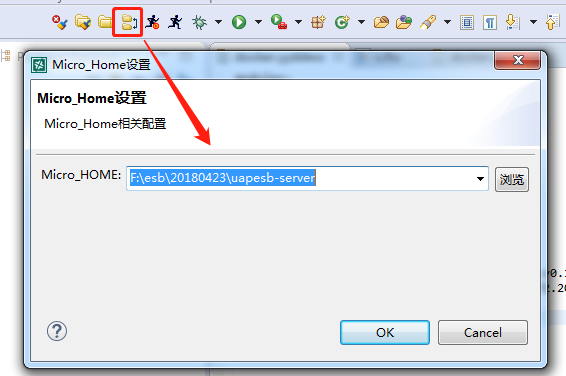
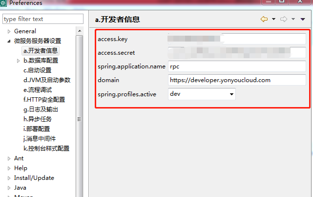
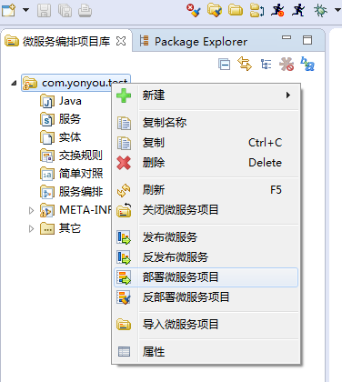
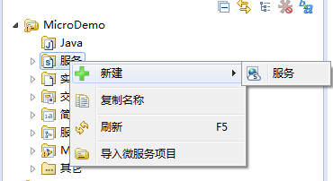
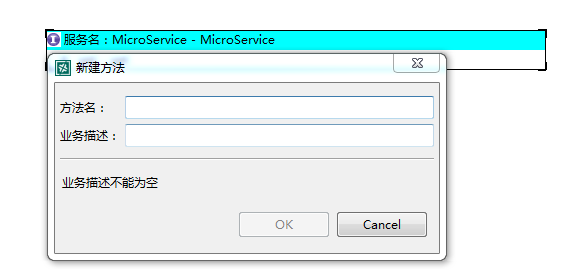
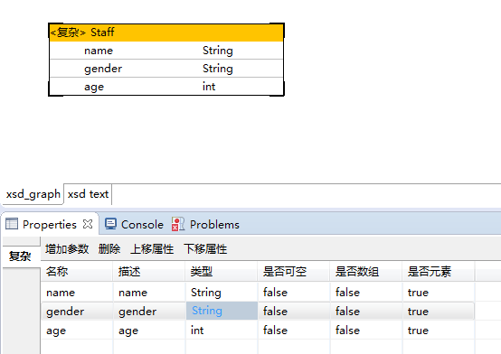
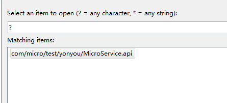
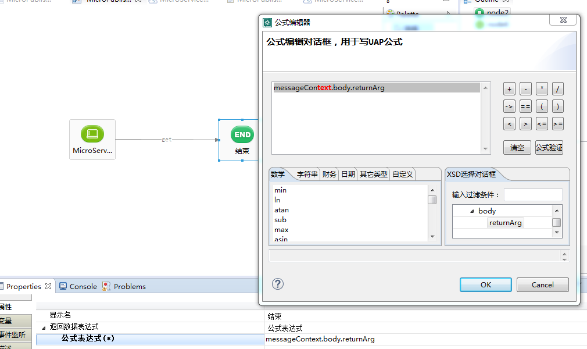
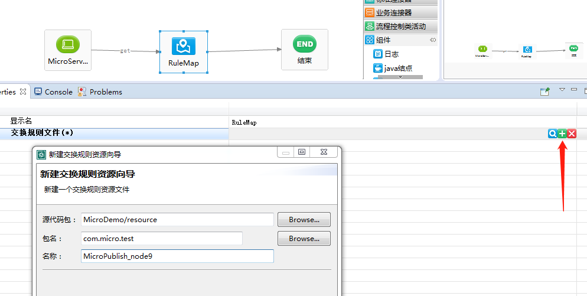

# 服务编排 #

微服务5.0.0-RELEASE提供了服务编排支持，并且提供了定制化的IDE,为开发微服务编排项目提供便利。

## 一：服务编排IDE配置 ##

微服务编排产品分两个部分：**UAP-Micro IDE** 和 **UAP-Micro Server**，使用之前要进行IDE的配置。

### （1）UAP-Micro IDE ###

1.双击esb.exe启动IDE环境；

2.配置 UAPMicro Server Home 路径；点击界面“更改Micro home”按钮，选择Micro_Home路径；

3.配置开发者信息

前两个参数是开发人员在开发者中心的Accesskey和secret，spring.application.name是应用名称，发布微服务时所采用的应用名称读取此配置，domain是开发者中心的域名，spring.profiles.active是采用的环境，列举如下:

- dev:开发（1）
- test:测试（2）
- stage:灰度（3）
- online:生产（4）

注意：括号内是环境编码。

### （2）UAP-Micro Server ###

UAP-Micro Server环境提供服务编排运行的容器. 利用IDE,微服务编排开发工具可快速开发新的业务服务编排，并部署到Server上运行，对外提供多样化的服务，真正实现微服务编排目标。

生产环境只需要安装Server，不需要安装IDE，在服务器上通过%Micro Server%bin/karaf.bat可以启动server，如果在开发阶段，开发人员可以在IDE中启动服务，IDE里有微服务编排的启动按钮。

**OSGi控制台：**

用户可以用telnet的方式管理当前所有运行的组件（bundle），具体操作步骤：开始->运行->cmd->telnet localhost（要管理的服务器IP地址） 9002（管理端口，在Microserver/etc/config.properties中进行配置），进入OSGi控制台进行查看组件运行状态，并进行管理和配置（关于OSGi控制台相关命令请查询相关文档）。

### （3）本地环境搭建 ###

UAP-微服务编排在环境搭建要求Micro Home的存在和系统数据源的正常访问。下面我们以在本地搭建微服务编排产品环境为例说时整个配置过程。

IDE、Server安装完成的情况下，进行下面的步骤和相应的确认工作：

i.	系统数据库正常可访问，测试连接可通过；

ii.	IDE配置MicroHome、开发者信息和系统数据源；

Micro Server的启动可以通过IDE的快捷键完成。

## 二：服务编排操作 ##

### (1) 新建微服务编排 ###

在微服务透视图中左上角的“微服务编排项目库”视图中用户可以新建“微服务编排组件工程”，如下图所示：

### (2) 部署微服务编排项目 ###

微服务编排项目完成以后，需要部署到服务器才能运行。选择完成的微服务编排项目，右键选择“部署微服务编排项目（Deploy Project）”，会将选择的微服务编排项目资源打包部署到当前服务器上。如下图：

### (3) 发布微服务编排项目 ###

当需要把微服务编排项目发布到开发者中心去的时候，就可以使用发布功能。
新建微服务编排项目的时候会自带一个配置文件：docker.yyddesc，如下图：

针对其中的一些参数做一些说明:
appName:发布的应用名称。必须唯一
environment：发布的资源池的环境。1:开发，2：测试，3：灰度，4，生产。
productLine：产品线
product:产品
appCode: 唯一值，可以和appName相同
imageName: 镜像名称，不能有大写
resPoolIds: 资源池名称，注意资源池的所属环境
port: docker内部端口
然后需要在首选项中配置正确的开发者中心账号对应的key,secret。然后发布成功之后就可以登录开发者中心，应用管理—产品线-产品-应用名称中找到已经发布的服务，显示健康运行之后便可以调用。

## 三：接口开发入门 ##

下面以一个简单的例子展示微服务编排的使用。此案例包含两部分：发布微服务和调用微服务。发布端完成性别转换的功能，男转换成male,女转换成female。调用端调用刚才的微服务，最终返回结果。

### (1) 案例分析 ###
微服务编排服务编排使用并不复杂，针对本案例，服务端，我们使用Micro节点作为开始节点，中间使用规则对照进行数据转换，最后以END节点输出结果。如下图所示：

而客户端我们使用REST节点作为开始节点，中间使用Micro节点用来调用上述发布的微服务，最后以END节点输出结果，如下图：

### (2) 编排设计 ###

Micro 平台下有专门的服务编排文件(.flw)与服务编排编辑器，我们用服务编排编辑器来进行编排设计。在微服务透视图下，微服务编排项目视图中的“服务编排”目录下新建一服务编排文件，IDE会默认用编排编辑器打开，在服务编排编辑器的右上角有一个向左的三角形，点击会弹出服务编排设计面板，如下图：

这里面有开始端点、标准连接器、业务连接器、服务编排控制结点，组件，这些结点的具体功能与用法会在第四章服务编排配置指南中进行详细讲解，下面是本案例的服务编排图建立过程：

#### a.创建服务 ####

服务编排的开始端点需要绑定服务，发布之后提供给外部调用。故第一步需要创建服务，根据向导创建服务，如下图

进入服务的编辑器，点击右键->创建方法。如下图

修改一下参数的名称，如下

#### b.创建实体 ####

根据例子场景，需要传递性别，不需要创建实体。如果传递的是一个人员，故需要建立人员的实体对象。选择编排工程，选中“实体”，右键“新建”实体，根据向导建立实体。如下图：

建立实体对象如下图

#### c.创建开始节点 ####

在服务编排设计面板中点击开始端点中的“Micro”结点，再将鼠标移动到服务编排编辑区，点击空白处，即可新建“Micro”结点。拖拽节点到画布中，需要先选择API，确定以后，则创建完Micro开始节点。如下图：

#### d.创建结束节点 ####

从设计面板中，服务编排控制类活动中选择“结束”节点，并拖拽至面板中，并右键打开“属性”面板，编辑返回值，选择公式表达式，并且将返回值配置为returnArg.如下图。

#### e.创建规则对照 ####

从设计面板组件中，选择“RuleMap”拖拽至Micro节点和结束节点之间的连线中，并打开属性页签，“新建”规则对照文件，如下图

点击确定，会自动创建规则对照文件。并自动带出第一个节点的输入参数和结束节点的返回参数。根据例子需求，需要将输入参数sex映射给返回参数中的returnArg。由于需要将性别“男”转为“male”，“女”转为“female”，故需要在性别属性中使用简单对照。需要先走下一步创建简单对照文件，创建以后，在简单对照的属性页签中，选择刚编辑好的简单对照文件。
如下图

#### f.创建简单对照文件 ####

由于对性别需要通过简单对照来转换，故需要创建简单对照，选中工程，选择“简单对照”右键新建简单对照。根据向导创建简单对照文件。如下图

配置简单对照文件内容，源值为男则目标值为male，源值为女则目标值为female。如下图:

#### g.创建微服务客户端 ####

上述是发布了一个微服务，下面我们我们来建立一个客户端，来调用刚才发布的微服务，我们使用”RestAPI”作为开始节点：
在服务编排设计面板中点击开始端点中的“RestAPI”结点，再将鼠标移动到服务编排编辑区，点击空白处，即可新建“RestAPI”结点。拖拽节点到画布中，需要先选择API，确定以后，则创建完RestAPI开始节点。如下图：

选中节点右键选择“属性编辑器（Property Editor）”也可修改属性，配置该rest节点属性方式如下图：

在服务编排设计面板中点击业务端点中的“Micro”结点，再将鼠标移动到服务编排编辑区，点击空白处，即可新建“Micro”结点。点击属性编辑器进行配置，如下图：

	
	API路径：选择我们刚才新建的服务即可 
	
	操作方法：选择对应的方法
	
	所属应用：代表我们要调用的微服务的应用名称，在这个例子中，这个值是首选项的开发者信息中的spring.application.name,复制过来进行填写。

创建一个结束节点，完成。

#### h.部署微服务编排项目并运行 ####

在微服务编排项目上右键部署并运行，如果控制台出现如下提示即表示部署成功.

一个是微服务发布成功，一个是rest发布成功。直接用浏览器进行访问，如下图：

