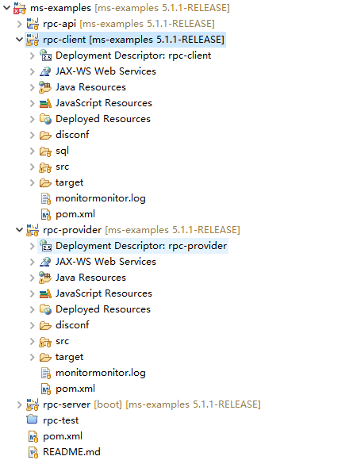
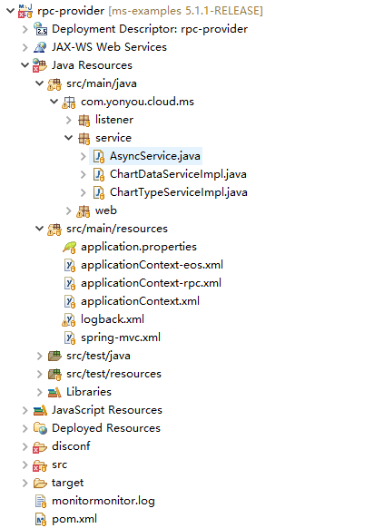

# 示例介绍

微服务治理平台提供针对5.1.1-RELEASE的官方完整示例工程，工程采用Maven构建，包含父工程（ms-examples）、公用API工程（rpc-api）、服务调用方工程（rpc-client）、服务提供方工程（rpc-provider、rpc-server）。

业务开发者可以将示例以已有Maven工程的方式导入到IDE中进行运行调试，导入到IDE中后，效果如下：

## ms-examples

ms-examples为几个示例工程的父工程，为pom类型，工程中规范了各个子工程引用的组件的版本，定义了各个maven插件的使用方式，以及部署仓库地址。

其中，使用的微服务治理平台SDK版本和IUAP开发平台组件的版本定义如下：

	<!-- 微服务治理平台SDK -->
	<mw.version>5.1.1-RELEASE</mw.version>
	<!-- IUAP开发平台版本 -->
	<iuap.version>3.2.1-SNAPSHOT</iuap.version>
	<!-- 请求加签SDK版本 -->
	<auth-sdk-client.version>1.0.15-SNAPSHOT</auth-sdk-client.version>

工程包含四个maven子工程，模块列表如下：

    <modules>
        <module>rpc-api</module>
        <module>rpc-client</module>
        <module>rpc-provider</module>
        <module>rpc-server</module>
    </modules>	

用户可以使用ms-examples工程对几个示例工程进行统一的编译和打包。

## rpc-api

rpc-api工程为其它三个工程的公共依赖，工程内定义了RPC同步调用和EOS异步调用中使用的接口，RemoteCall注解和Async注解会标记在各个接口上。示例中使用到的接口列表如下：

- IChartDataService ： 普通的RPC调用接口示例；
- IChartTypeService ： 使用配置文件声明接口示例；
- IStatisticsService ： 使用SpringBoot方式作为提供方的接口示例；
- INotifyService ： EOS异步调用接口示例；

各个接口的实现分布在rpc-provider和rpc-server两个服务提供者工程中，接口中使用到了注解，注解示例如下：

	//注解中value的格式为appcode@providerid
	@RemoteCall(“rpc-provider@c87e2267-1001-4c70-bb2a-ab41f3b81aa3”)

	//使用Async注解标识异步方法
	@Async
	public void notify(String msg) throws Exception;

开发者在本地IDE中开发调试过程中，可以将此工程在本地install之后再调试其他工程。

## rpc-client

rpc-client工程为微服务的调用方示例，示例中引入了SpringMVC框架，开发者可以在运行起几个示例工程之后，使用浏览器或者PostMan工具访问RestFul服务进行测试。例如，简单RPC调用的测试访问地址为：

	http://localhost:8080/rpc-client

rpc-client工程的本地服务中，使用spring的方式依赖了远程服务的接口，依赖的示例代码如下：

	@Autowired
	private IChartDataService remoteDataService;

	@Autowired
	private IChartTypeService remoteTypeService;

	@Autowired(required=true)
	private INotifyService notifyService;

客户端可以像调用本地服务一样调用上述远程服务。

## rpc-provider

rpc-provider为RPC的服务提供者示例，是IChartDataService接口和IChartTypeService接口的具体实现类所在的工程，提供远程接口的业务实现，工程引用了微服务治理平台提供的SDK，在服务的启动过程中，会将远程接口的元数据信息上报到后端，在统一的管理面板上可以看到接口的API信息。

此Maven工程的结构如下图所示：

其中，applicationContext.xml为工程的spring主配置文件，定义了扫描包和属性文件的引入，applicationContext-rpc.xml为RPC Bean配置文件，applicationContext-eos.xml为异步调用配置文件。

## rpc-server

rpc-server工程演示如何使用SpringBoot的方式开发微服务，被rpc-provider中的接口调用，作为服务的第三层；其演示了服务的多层调用的场景，调用成功后，可以从服务的管理面板上查看到三层的调用链路关系。

SpringBoot示例工程的主启动类为RpcServerApplication，其主方法示例如下：
	
	@SpringBootApplication
	public class RpcServerApplication extends SpringBootServletInitializer {
	
		public static void main(String[] args) {
			SpringApplication.run(RpcServerApplication.class, args);
		}
	
		@Override
		protected SpringApplicationBuilder configure(SpringApplicationBuilder builder) {
			return builder.sources(RpcServerApplication.class);
		}
	
	}

